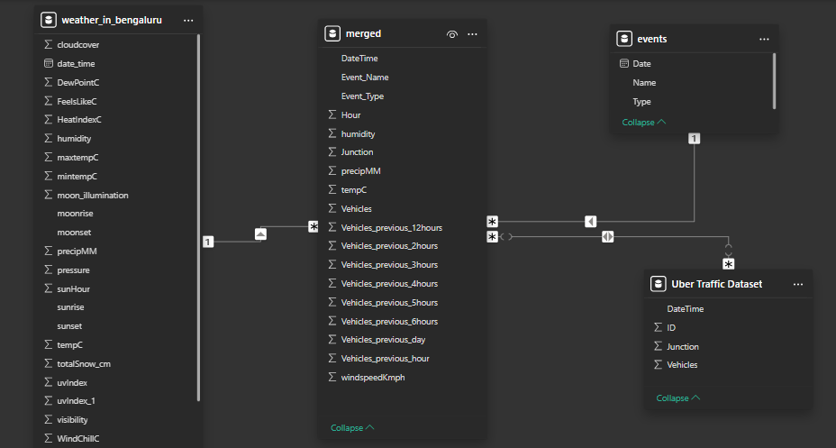

# Traffic Congestion Prediction and Analysis Using Time Series and Machine Learning Models

### Overview:
This project involves predicting traffic congestion levels at various junctions using time-series data and advanced machine learning models. The primary models used for forecasting were ARIMA (AutoRegressive Integrated Moving Average) and LSTM (Long Short-Term Memory) neural networks. The goal was to compare the effectiveness of these models and further enhance predictive performance through ensemble techniques, such as Random Forest and XGBoost. In addition to traffic prediction, several visual analyses were conducted to better understand the relationships between congestion levels and external factors like weather conditions and events.

---

### Part 1: Data Preprocessing and Initial Analysis
The dataset used contains 58,368 entries of hourly traffic data, including weather information and event data. Key features included the number of vehicles at different junctions, date and time, temperature, precipitation, humidity, and wind speed.

#### Key Steps:
- **Data Cleaning**: Converted DateTime columns to the correct format, removed irrelevant columns, and handled any missing values. Traffic data for Junction 4 was incomplete, so missing records were imputed by creating new records with zero vehicles.

#### Feature Engineering:
- Time-based features such as Hour, DayOfWeek, and Month were generated.
- Lag features, including the number of vehicles in the previous hour, previous day, and previous 12 hours, were created to improve the predictive power of time-series models.
- Weather data such as temperature, precipitation, humidity, and wind speed were merged into the dataset.

#### Visualizations and Insights:
- **Heatmap**: A correlation heatmap was generated to analyze the relationships between traffic and weather factors. There was a positive correlation between temperature and the number of vehicles, while humidity had a negative correlation.

-----

### Part 2: Traffic Congestion Analysis and Visualizations
This part includes various analytical plots and visualizations to understand traffic patterns better.

#### Key Analyses:
- **Average Vehicles per Hour**: The number of vehicles at different hours of the day was plotted to identify peak hours. The highest traffic was recorded between 6 PM and 8 PM.
- **Average Vehicles per Day of the Week**: A bar chart revealed that traffic was generally heavier on weekdays, with weekends and Mondays showing low congestion levels.
- **Average Vehicles per Month**: Traffic data was grouped by month to reveal seasonal trends. Traffic was found to peak in the summer months, particularly in June.
- **Correlation with Weather**: A correlation matrix was generated, showing that temperature had a slight positive correlation with traffic, while humidity had a negative effect.

#### Visualizations:
- **Scatter Plot (Vehicles vs. Temperature)**: A positive relationship was observed between temperature and traffic, with more vehicles recorded at higher temperatures.
- **Scatter Plot (Vehicles vs. Precipitation)**: Showed that traffic volume slightly decreased during higher precipitation.

#### Peak Hour Identification:
The analysis revealed the busiest times for traffic, which can be valuable for urban planners and traffic management authorities.

---

### Part 3: Effects of Traffic on Uber Fare Prices
Understanding how traffic impacts Uber fares is important for both riders and drivers. This part of the project explored the mechanisms through which traffic congestion influences fare prices, focusing on:

- **Surge Pricing**: Traffic congestion leads to longer trip durations, reducing the supply of available Uber drivers. This supply-demand imbalance triggers surge pricing, leading to higher fares.
- **Time and Distance-Based Calculations**: Uber fares are calculated based on the distance traveled and time spent on the trip. Traffic congestion increases travel times, directly impacting the time-based component of fare calculations. In congested areas, fares rise due to extended trip durations

#### References:
- Phillips, J. (2022). How Uber’s dynamic pricing model works. Uber Blog.
- Vatech (2024). How are Uber prices calculated: A clear explanation - manuals.

---

### Part 4: Model Evaluation and Refinement
This section describes the process of evaluating and refining the models used to predict traffic congestion.

#### Data Preparation:
The dataset was cleaned and preprocessed, including adding lag features, weather data, and event details to ensure it was ready for analysis.

#### Model Selection:
- **ARIMA**: Selected for its effectiveness in time-series forecasting, particularly for linear trends.
- **LSTM**: Chosen for its ability to capture complex, non-linear patterns in sequential data.

#### Model Training:
- **ARIMA**: Hyperparameters were tuned using grid search, selecting the best combination of (p, d, q) values.
- **LSTM**: Grid search was used to optimize the number of units, epochs, and batch size.

#### Model Evaluation:
- **ARIMA**: Achieved a MAE of 0.1059 and RMSE of 0.1637.
- **LSTM**: Significantly outperformed ARIMA, with a MAE of 0.0169 and RMSE of 0.0259.

#### Cross-Validation:
A five-fold TimeSeriesSplit cross-validation was implemented to evaluate model robustness. Both models demonstrated consistent performance across the folds, with LSTM showing minimal variation.

#### Residual Analysis:
The LSTM model had residuals centered around zero, indicating unbiased predictions, while the ARIMA model showed systematic bias.

#### Feature Importance:
A feature importance analysis identified that the number of vehicles in the previous hour, as well as hour of the day and day of the week, were the most important predictors.

---

### Part 5: Ensemble Model Development
To further improve predictive accuracy, an ensemble approach combining Random Forest and XGBoost was developed.

#### Results:
- **Ensemble Model**: Achieved a MAE of 0.0166 and an RMSE of 0.0259, showing a slight improvement over the individual LSTM model.

#### Future Work:
Future efforts will focus on refining feature engineering, exploring new weather and traffic-related features, and further tuning the ensemble models for enhanced performance.

---

### Conclusion:
This project successfully demonstrated that machine learning models, particularly LSTM and ensemble methods, can effectively predict traffic congestion levels. The insights derived from this project, such as the impact of traffic on Uber fares and the importance of weather in traffic patterns, provide actionable knowledge for transportation planning, traffic management, and ride-sharing services.
